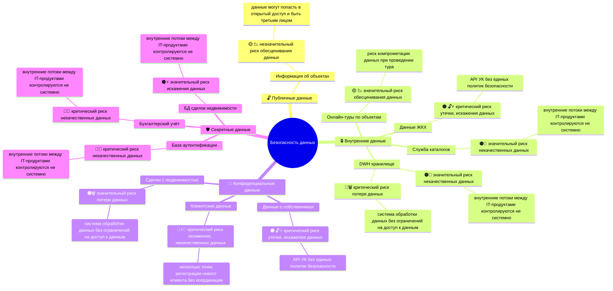

# Аудит информационной безопасности информационной системы PropDevelopment

## Классификация данных в системе согласно ISO 27002

| Данные                      | Категория           | Обоснование                                              |
|-----------------------------|---------------------|----------------------------------------------------------|
| **База аутентификации**     | 🛡️ Секретные       | Учетные данные, Безопасность системы                     |
| **Бухгалтерский учёт**      | 🛡️ Секретные       | Финансовая отчетность, Налоги                            |
| **БД сделок недвижимости**  | 🛡️ Секретные       | Финансовые операции, Коммерческая тайна                  |
| **Данные о собственниках**  | 🔐 Конфиденциальные | Персональные идентифицируемые данные                     |
| **Клиентские данные**       | 🔐 Конфиденциальные | Коммерческая тайна, Персональные идентифицируемые данные |
| **Сделки с недвижимостью**  | 🔐 Конфиденциальные | Коммерческая информация                                  |
| **Онлайн-туры по объектам** | 🔒 Внутренние       | Бизнес-процессы, Технические данные                      |
| **Данные ЖКХ**              | 🔒 Внутренние       | Операционная информация                                  |
| **Служба каталогов**        | 🔒 Внутренние       | Организационная структура                                |
| **DWH хранилище**           | 🔒 Внутренние       | Агрегированные данные                                    |
| **Информация об объектах**  | 🔓 Публичные        | Общедоступные данные                                     |

## Карта рисков по категориям данных

Классификация рисков

- по типу риска
    - 🔓 утечка данных
    - 🗑️ потеря данных
    - ⚡ искажение данных
    - 🧩 некачественные данные
    - 📉 обесценивание данных
- по степени риска
    - 🟡 незначительный риск
    - 🟠 значительный риск
    - 🔴 критический риск

**Карта рисков**

